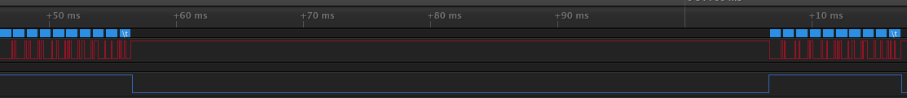

# raspi3_rs485_example

Prepare
==
You should use this code after setting below link.  
https://github.com/chandong83/raspi3_rts_on

Usage
==
<pre>
<code>
$git clone https://github.com/chandong83/raspi3_rs485_example
</code>
</pre>

<pre>
<code>
$make -j4
</code>
</pre>

<pre>
<code>
$rs485_exam 0 0  : by Hardware RTS It can't be used yet.
$rs485_exam 1 0  : by Software RTS
$rs485_exam 1 1  : by Software Invert RTS  
</code>
</pre>

ScreenShot
==
by Software Invert RTS

