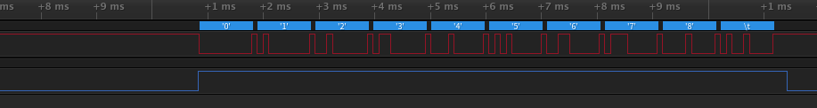

# raspi3_rs485_example

Prepare
==
You should use this code after setting below link.  
https://github.com/chandong83/raspi3_rts_on

This code was referenced by below the link.  
http://elinux.org/RPi_GPIO_Code_Samples#Direct_register_access

Usage
==
<pre>
<code>
$git clone https://github.com/chandong83/raspi3_rs485_example
</code>
</pre>

<pre>
<code>
$make -j4
</code>
</pre>

example command
<pre>
<code>
$rs485_exam [mode] [option]
mode : 0, HW RTS, 1, SW RTS, 2 SW GPIO
option : when mode is 1, Invert RTS (1 : enable Invert RTS)
         when mode is 2, GPIO Pin Number

$rs485_exam 0 0  : by Hardware RTS It can't be used yet.
$rs485_exam 1 0  : by Software RTS
$rs485_exam 1 1  : by Software Invert RTS  
$rs485_exam 2 17 : by Software GPIO 17
</code>
</pre>

ScreenShot
==
by Software Invert RTS

by Software GPIO

